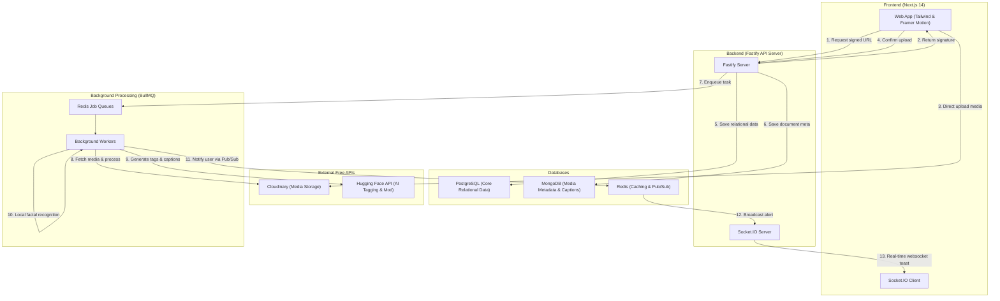

# 🎨 PixelVault — Event & Media Management Platform

[](https://www.typescriptlang.org/)
[](https://nextjs.org/)
[](https://www.fastify.io/)
[](https://www.postgresql.org/)
[](https://www.mongodb.com/)
[](https://redis.io/)

PixelVault is a production-grade, premium Event & Media Management Platform built specifically for university clubs, societies, and organizations. It replaces scattered Google Drive links, emails, and manual tagging workflows with an integrated, automated media vault. 

It is designed to run on a **100% Free Stack** without relying on expensive, paid cloud features.

---

## ⚡ Key Features

*   **🔒 Secure Role-Based Access (RBAC)**: Supports roles (`admin`, `photographer`, `club_member`, and `viewer`) with granular route-level and media accessibility logic. Includes JWT access/refresh token rotation.
*   **📷 Direct-to-Cloud Uploads**: Files bypass the server during upload, uploading directly from the browser to **Cloudinary** using secure, signed signatures to optimize bandwidth.
*   **🤖 Smart AI Tagging**: Uses a free **Hugging Face ViT Image Classification** inference pipeline to auto-generate descriptive tags and check content safety (NSFW moderation).
*   **👤 Local Facial Recognition**: Employs a local **face-api.js** engine utilizing WebAssembly CPU acceleration. Users can enroll their selfie to automatically locate, match, and tag themselves in all event group photos.
*   **💬 Real-Time Notifications**: Integrated with **Socket.IO** backed by a Redis pub/sub adapter. Instantly triggers notification updates, browser toasts, and message badges for likes, comments, and tags.
*   **🖼️ Dynamic Role-Based Watermarking**: Uses **Sharp** to dynamically overlay SVGs showing the club name, event name, user role, and download timestamp.
    *   *Privileged Roles (`admin`/`photographer`)*: 30% opacity, subtle bottom-right position.
    *   *Standard Roles (`club_member`/`viewer`)*: 50% opacity, repeating diagonal center overlay.
*   **🔗 QR Album Sharing**: Instantly generates scan badges pointing directly to vault albums to simplify sharing.
*   **🔍 High-Performance Search**: Faceted query engine powered by **PostgreSQL Full-Text Search** to filter media by event, tags, date range, uploader, or visibility.
*   **📊 Premium Analytics**: Interactive charts powered by **Recharts** inside a dark-themed, glassmorphic admin panel showing upload trends, top events, and server queue status.

---

## 🏗️ System Architecture



---

## 🗂️ Project Structure

```
event-media-platform/
├── apps/
│   ├── frontend/                  # Next.js 14 Web Client (Tailwind & React Query)
│   │   ├── src/app/               # App Router pages (auth, dashboard, admin, profile, search)
│   │   ├── src/components/        # Layout & custom UI primitives (Lightbox, UploadZone)
│   │   └── src/lib/               # Client contexts (auth, sockets) & Axios instance
│   │
│   └── backend/                   # Fastify Node.js API
│       ├── src/index.ts           # Server entry point
│       ├── src/lib/               # Database client singletons (prisma, mongo, redis)
│       ├── src/routes/            # API endpoint groups
│       ├── src/workers/           # BullMQ queue processors (process, tags, face-detect)
│       └── src/services/          # Helper modules (watermark, notification)
│
├── docker-compose.yml             # Local PostgreSQL, MongoDB, Redis stack
├── package.json                   # Monorepo workspaces definition
└── pnpm-workspace.yaml            # pnpm workspace configurations
```

---

## 🚀 Quick Start (Local Development)

### 📋 Prerequisites
*   Node.js (v20+ or v24+)
*   pnpm (v9+)
*   Docker Desktop (installed and running)

### 1. Setup Environment
Clone the repository and copy the environment template:
```powershell
cp .env.example .env
```
*(Open `.env` and fill in your Cloudinary and Hugging Face API keys. All database URLs are preconfigured to connect to the local Docker containers automatically).*

### 2. Start Databases
Spin up the PostgreSQL, MongoDB, and Redis containers:
```powershell
docker-compose up -d
```

### 3. Install Dependencies
Install packages and generate database clients:
```powershell
pnpm install
pnpm db:generate
```

### 4. Run Migrations & Seed Data
Initialize database tables and seed sample data (photography club, demo events, albums, and test accounts):
```powershell
pnpm db:migrate
pnpm --filter backend run db:seed
```

### 5. Download Neural Weights
Fetch the required local facial recognition model shards:
```powershell
pnpm download-models
```

### 6. Run the Application
Launch all dev servers (Next.js frontend, Fastify backend, and BullMQ background workers):
```powershell
pnpm dev
```
*   **Web App**: `http://localhost:3000`
*   **API Server**: `http://localhost:4000`
*   **API Docs (Swagger UI)**: `http://localhost:4000/api/docs`

---

## 👥 Seed Accounts

Use these pre-configured accounts to explore different roles inside the platform:

| Role | Username / Email | Password | Permissions |
|------|------------------|----------|-------------|
| **Admin** | `admin@demo.com` | `Admin@123` | Full control over clubs, watermarks, roles, and media moderation. |
| **Photographer** | `photo@demo.com` | `Photo@123` | Can create events, sub-albums, and bulk-upload media. |
| **Member** | `member@demo.com` | `Member@123` | Can view club-only media, comment, and enroll face for auto-tagging. |

---

## 📡 Core API Reference

The backend API is documented with Swagger JSDoc. Access it at `http://localhost:4000/api/docs`.

### Authentication
*   `POST /auth/register` - Create a new user account.
*   `POST /auth/login` - Authenticate and receive accessToken/refreshToken.
*   `POST /auth/refresh` - Rotate expired JWT access tokens.
*   `POST /auth/logout` - Invalidate active session.

### Events & Albums
*   `GET /events` - List events with sorting (`name`, `date`, `category`).
*   `POST /events` - Create event (Photographer+).
*   `POST /events/:eventId/albums` - Add sub-albums (Photographer+).
*   `GET /albums/:id/qr` - Generate a QR code badge for mobile sharing.

### Media & Social
*   `POST /media/presign` - Request Cloudinary direct-upload authorization.
*   `POST /media/confirm` - Log completed upload and trigger AI workers.
*   `GET /media/:id/download` - Stream image dynamically with role-based watermark.
*   `POST /media/:id/like` - Toggle photo like (real-time notification to owner).
*   `POST /media/:id/comments` - Add threaded comments.

### Facial Recognition & Search
*   `POST /users/me/face-enroll` - Upload selfie to enroll face descriptors.
*   `GET /users/me/my-photos` - Get all photos where the user was auto-detected.
*   `GET /search` - Faceted search on uploader, tags, events, and date ranges.
